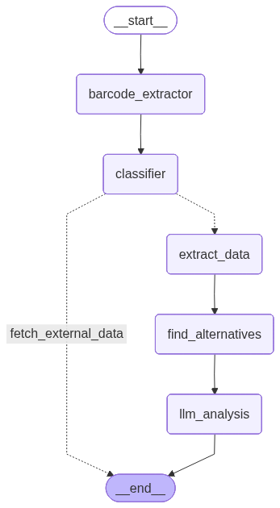

# Eatellect - AI-Powered Food Health Analyzer

An intelligent system that analyzes food products through barcode scanning and provides detailed health insights using advanced AI, powered by LangGraph and Groq.

## 🚀 Quick Start

1. Clone the repository:
   ```bash
   git clone https://github.com/AkbariKishan/eatellect_app.git
   cd eatellect_app
   ```

2. Set up virtual environment:
   ```bash
   python -m venv .venv
   source .venv/bin/activate  # On Windows: .venv\Scripts\activate
   ```

3. Install dependencies:
   ```bash
   pip install -r requirements.txt
   ```

4. Set up environment variables:
   ```bash
   cp .env.example .env
   # Edit .env with your Groq API key
   ```

5. Run the application:
   ```bash
   streamlit run app.py
   ```

## 🌟 Features

- 📸 Barcode scanning from images
- 🔍 Product information lookup from Open Food Facts
- 🧮 Nutritional analysis and health scoring
- ⚠️ Allergen detection
- 🤖 AI-powered health insights and recommendations
- ⚡ Parallel processing for faster results

## 📊 Optimized Agentic Workflow

```
┌─────────────────────────────────────────────────────┐
│                OPTIMIZED WORKFLOW                    │
└─────────────────────────────────────────────────────┘

START
  │
  ▼
┌─────────────────┐
│ BARCODE NODE    │    • Image scanning
│                 │    • Barcode extraction
└────────┬────────┘    • Product data fetching
         │
         ▼
┌─────────────────┐
│ CLASSIFIER      │    • Data validation
│                 │    • Analysis type determination
└────────┬────────┘
         │
    ┌────┴────┐
    ▼         ▼
  [DATA]    [NO DATA] ──▶ END
    │
    ▼
┌─────────────────┐
│ PARALLEL        │    Concurrent execution:
│ DATA            │    • Nutritional extraction
│ EXTRACTION      │    • Allergen detection
└────────┬────────┘    • Health scoring
         │
         ▼
┌─────────────────┐
│ PARALLEL        │    Concurrent generation:
│ LLM ANALYSIS    │    • Health insights
└────────┬────────┘    • Recommendations
         │
         ▼
        END
```

## 🛠️ Architecture

- `src/agents/`: Core workflow nodes and parallel processing implementation
- `src/tools/`: Specialized tools for nutrition analysis, barcode scanning, etc.
- `src/graph/`: Workflow graph definition and execution
- `src/models/`: LLM configuration and model setup
- `src/state/`: State management for the workflow
- `config/`: Configuration settings and constants

## 🔧 Configuration

The application requires the following environment variables:

```bash
GROQ_API_KEY=your_groq_api_key_here
# Optional configurations
DEBUG=True
LOG_LEVEL=INFO
```

## 🧪 Testing

Run the tests using:
```bash
pytest
```

## 📝 Contributing

1. Fork the repository
2. Create a feature branch: `git checkout -b feature/new-feature`
3. Commit your changes: `git commit -am 'Add new feature'`
4. Push to the branch: `git push origin feature/new-feature`
5. Submit a pull request

## 📄 License

This project is licensed under the MIT License - see the [LICENSE](LICENSE) file for details.

## 🙏 Acknowledgments

- [Open Food Facts](https://world.openfoodfacts.org/) for their comprehensive food database
- [LangGraph](https://github.com/langchain-ai/langgraph) for the workflow framework
- [Groq](https://groq.com/) for their LLM API

